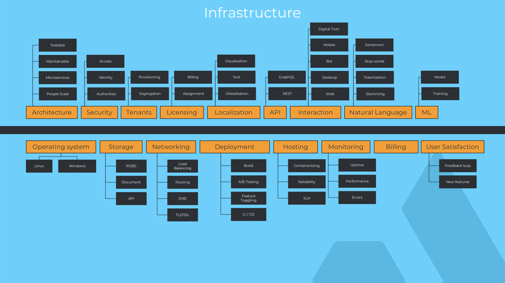
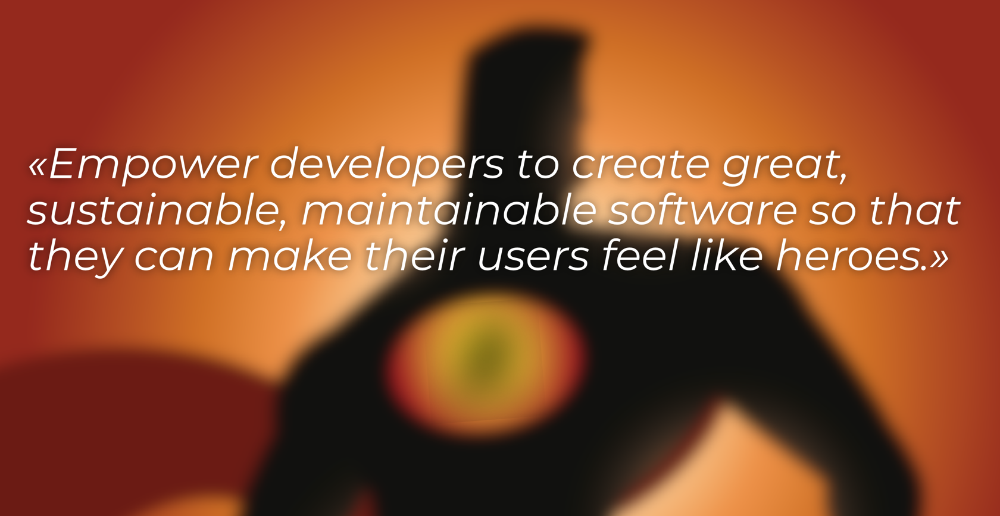
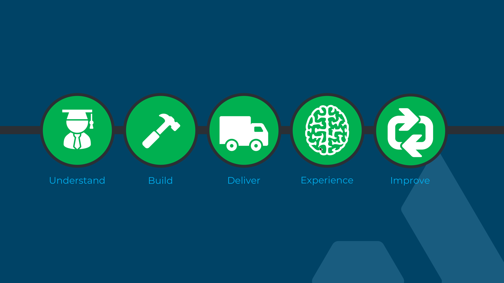
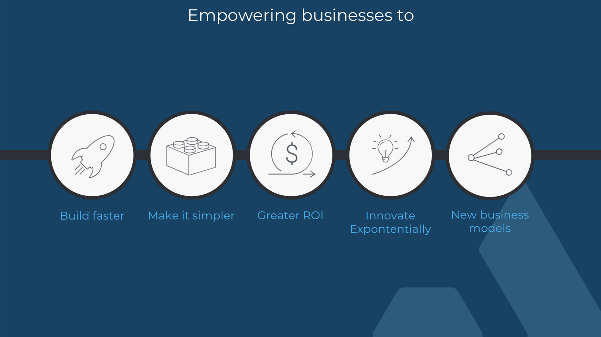

# Focusing on the business value

In software, whenever you do a "File -> New Project" you start with a clean slate and for a lot of developers this is a
very joyful occasion; technical decisions has to be made - should we do this or this programming language, so and so
database, frontend framework of the week and fun fun fun. For others, this is just in the way of delivering the business
value so desperately needed from the domain experts that commissioned or at least needed software to make their life
easier. In addition to having to make all these decisions, you're faced with having to build infrastructure - things
that really are somewhat unrelated to the domain problems one is trying to solve - but they just have to be there in
order for everything to make sense.

These are just some of the things you typically need to think about, often at times its a lot more - especially if you're
providing the software as a "Software as a Service" offering. All of a sudden you get into a different business than
you probably set out to be in; hosting, operating and maintaining another layer of infrastructure. Even though the public
cloud offerings out there has helped on commoditizing and democratizing infrastructure through, it still is a layer
that needs to be provisioned, maintained and looked after to be able to deliver the SLA (Service Level Agreement) that
is required. That on its own is often also for software vendors a new term; SLA. A legally binding guarantee of availability,
responsiveness and scalability - something that was much easier when you were just sending out your software on a CD or
making it downloadable from a web site, not having to worry about what infrastructure it was running on. This also again
taking away precious focus on delivering the business value.

Once you get to the focus on business value, things might have changed and you might have to go back and reconsider decisions
already made. At Dolittle our primary objective is to let developers focus on business value.

## Continuous Improvement

The concepts of continuously doing things like integration, deploy and release are summed up in what we refer to as
**Continuous Improvement**. It encapsulates all of the CI/CD things but helps put forward a mindset of why we're doing
what we're doing. We're there to improve the lives of our users - in fact we are continuously working towards that goal.
Be it implementing a new feature or bug that needs fixing, both cases will improve the users experience. 

### Understand

Understanding what the users needs is the starting point of the cycle. Since our platform is oriented around events and
modelling these as state transitions, we also start any project my understanding what the state transitions in a system are
and how they should be captured. This is done through using [event storming](https://en.wikipedia.org/wiki/Event_storming)

### Building

We go straight into building the business value, without having to think about infrastructural pieces. Very little ceremony
needed to get started, a few decisions and you're off in the matter of minutes.

### Deliver

By just checking in your code, you've done your part of delivering. Governance on the project decides how it gets in the
hands of the users - automatically based on different strategies or through manual steps for doing quality assurance.

### Experience

The user starts using anything new straight away and the platform collects telemetry on usage and we start experiencing
what works and what doesn't.

### Improve

Rince repeat - based on the experience, one can now start understanding more and make life even easier for the end user.

## Being opinionated

Part of building out Dolittle is allowing ourselves to be opinionated. Opinionated on core principles and approaches and on
how things are being done allows benefits across the board and provides predictability. Developers can follow well defined
recipes for building features and focus on the users requirements.

The potential downside is always flexibility. There is a sacrifice to be made in order to gain the predictability.
It is a balance and it is possible to provide a certain level of flexibility on certain parts, while other parts are more
opinionated. This is a balance we keep a close eye on and want to be reactive towards. By being modular all the way, one can pick and chose the composition one wants. The way we write our code from the [fundamentals](https://github.com/dolittle/dotnet.fundamentals) to [runtime](https://github.com/dolittle/runtime) to the [SDK](https://github.com/dolittle/dotnet.sdk), we keep a close eye on not locking things down and throw away the key.

## Extensibility

Key success factor of our code base is its flexibility for swapping in and out implementations. If you're not happy with
a particular implementation, roll your own, contribute back to the community or find a better one already out there.
This is what is at the heart of everything we do, not just backend code but frontend - or maybe even especially frontend.
There are decisions to be made on "the edge"; the surroundings of the core fabric. Typically concrete technology
requirements such as a specific database to be used or for the frontend a specific framework. We take painstaking care
of making sure we do not close any doors and if we do we go back and redesign so that the architecture and abstractions are
right. Sometimes we don't want to put in an abstraction directly for a specific type of technology, but rather find a way
for the developer to do the technology specifically and isolating it. This is for instance true to how we've formalized
[Queries]() - you have a contract in the form of the name of the query in type and any parameters it needs to be able to be
dynamic, and then you provide the implementation. This implementation can then be linked directly to the underlying technology
you're targeting. We feel that this approach is much better than trying to pretend that databases are the same - they
simple aren't. The nuances are so different that you really can't just go between them. Rather than abstracting way, you
basically then have an isolation in place.

## Building blocks

For everything that we do, we try to find the building blocks needed to build the Line of Business type of applications.
These are somewhat different than you find in more generic approaches. Take for instance in the .NET space, a common
building block is a [Controller](https://docs.microsoft.com/en-us/aspnet/core/tutorials/first-web-api?view=aspnetcore-2.0).
It is pretty much the only building block and is being used for all scenarios, even though there are different requirements.
It then gets bent with ActionFilters or similar to accommodate the different scenarios.y
This model makes everything generic - and one could argue its a simpler model, since you'd pretty much only have to
learn the mechanics of how a controller works. But it is very easy to violate good practices such as [separation of concerns](https://en.wikipedia.org/wiki/Separation_of_concerns) and the [SOLID](https://en.wikipedia.org/wiki/SOLID) principles.
Instead, what we at Dolittle do is to formalize the building blocks into what they do and
should do well - without breaking these principles that we stand for and believe in.

Good example of this is the total separation of commands and queries. In a RESTful architecture based on something like
.NET, these would be actions on a controller. Often at times on the same controller - nothing in .NET saying it has to,
but most samples and guidance point in this general direction. We see these as two very different problems, with quite
different requirements for performance, scale, security, validation and business rules. Who all are again different
building blocks on their own. Breaking it into smaller problems makes it a lot easier to maintain each problem in isolation.

## What sparked Dolittle?

Dolittle did not happen over night. Its running close its 10 year anniversary of its inception.
Certainly a lot has changed over the years and there is hardly any resemblance to what we started off with.
The thing that sparked it was experience with building software throughout the years with approaches that felt old and not
current with how the world looks today. The n-tier architecture approach is something that has been going on for decades
and we felt pain with it and wanted to try out new things. We went down the path of [CQRS](https://en.wikipedia.org/wiki/Command–query_separation#Command_query_responsibility_segregation)
and started diving into events all founded in [Domain Driven Design](https://en.wikipedia.org/wiki/Domain-driven_design) with
the desire to find how we could translate the building blocks mentioned in the book into something more tangible. We also saw that we spent too much time agonizing over technical decisions and things that didn't add business value. Based on the experience with a few of these projects we started seeing a set of repetitive
patterns that we wanted to formalize and not have to repeat. A lot of iterations went into getting some of these abstractions
right and we got it wrong quite a few times and are still seeing some of that legacy and still learning more on how to
improve this.

## Learn more?

Even though we've been at this game for a while, we've as many other software projects out there not put too much effort on documentation.
Something we are working on improving these days. Our official [site](http://www.dolittle.io) has some documentation and will gain more over
the next coming months. We're also going to be posting content here on this blog and do videos over at our [YouTube Channel](https://www.youtube.com/channel/UCO54aeNeVzKFYVo7sVsXlAA). Everything that we do is done in the open, you can find all our
projects and a list of our organizations [here](https://github.com/dolittle/home).

For the core principles at play in the Dolittle platform, you can find an article [here](http://www.dolittle.io/Articles/overview.html).

## Empowering businesses

We're very excited about the future and what it holds. We are very committed to our primary objectives:

Follow this blog if you want to learn more of what we're all about and how we are thinking about software development and artifacts
surrounding software development - such as agreements, sales and more. We have a few ideas around these things as well.