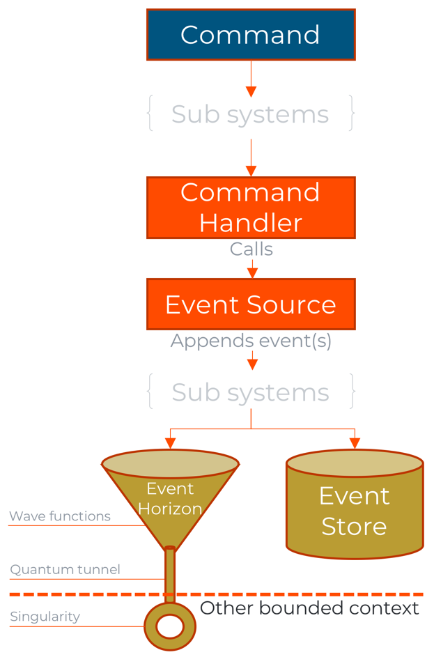

# Event Horizons

When building software that gets broken up [into smaller pieces](), you have to compose it back together.
These different pieces are a composition of different verticals of the software and within these verticals
there are different concerns like the frontend, domain, queries and more.

With events as the centerpiece for describing the state changes in a system, we have a great opportunity to
use it as the primary contract between the different vertical slices in a system - but also between different
systems, if authorized to do so. This is were event horizons come into play. We've been working with this concept
for a while and have called it a couple of things already internally and to a certain extent in public;
Mediator or inter-bounded-context-communication. Neither of these really had much of an appeal to what it is
in fact doing, and we decided to go outside the realm of computer science into the science of general relativity
to find concepts that could match.

The simplified end to end model of this looks as follows:

## Event Horizon

The event horizon represents the final entry for committed events. At this point they can only be seen by other singularities.
In Dolittle, a singularity would then be a running node that is connected to this event horizon and receives a stream of particles.
The particles, representing committed events. By committed events, we mean events that has been persisted into an event store.

## Singularity

A singularity represents a single destination point for an event-particle. This is typically another bounded context.
The bounded context is most of the time from the same application, but can also be part of another application.

## Quantum Tunnel

Each singularity can connect to any event horizon, they establish a quantum tunnel for the purpose of passing particles through.
The singularity is aware of available event horizons and establishes the connection actively. It establishes the connection
with information saying at what offset it has received from last time it was connected and also which events it is
interested in with an `Application Artifact Identifier` that holds information about the event and generation.
When connected, the source system will start transmitting events across from the offset given at connect and only those
event types that are asked for.

## Wave Function

The process of crossing through a quantum tunnel over to a different singularity might cause the particle to have its
[quantum state](https://en.wikipedia.org/wiki/Quantum_state) collapsed.
This is to ensure it is compatible with what is expected in the target singularity.
Different bounded contexts or even applications should be able to move forward with their own release
cadence and be completely autonomous. Events can mutate its shape over time. Every mutation is known as
a generation. Between these mutations one needs strategies to be able to migrate through generations, both backwards
and forwards. These migrations are used both in the context of the event store and in the context of event horizons.
Explicit migrations declares how the migration of properties from one generation to the other.
Some mutations are safe to support by convention, typically when a new property is introduced.
It is then possible to downgrade from one generation to an earlier generation by just ignoring the extra properties.
However, this poses an issue when the target system introduces support for the new generation with the new property
on it. This is something we're still exploring solutions to.

## Particle

[Particles](https://en.wikipedia.org/wiki/Particle) are small objects, and in Dolittle there is an event particle. This is the thing that passes through the event horizon into each singularity. Events are small data transfer objects that holds primitive
values only. Alongside an event sits a bag of metadata, which tells more details about how the event occurred, context like
tenant, user and when it occurred.

## Technically

The implementation is using [gRPC](https://www.grpc.io) for connectivity, which then relies on [protobuf]().
As a general principle we define all our services and message formats using `PROTO3` definitions that are found [here]https://github.com/dolittle/Runtime/tree/master/Protobuf).
Specifically for our Event Horizon, you'll find it [here](https://github.com/dolittle/Runtime/tree/master/Protobuf/dolittle/interaction/events.relativity).

